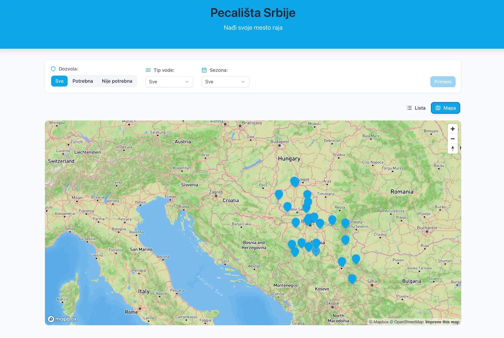
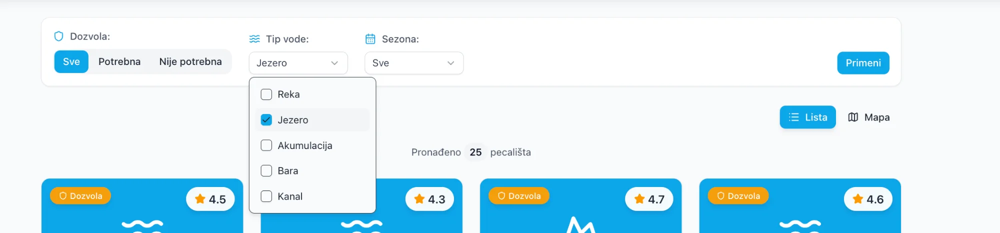
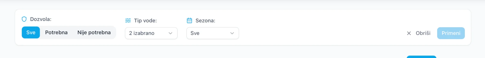
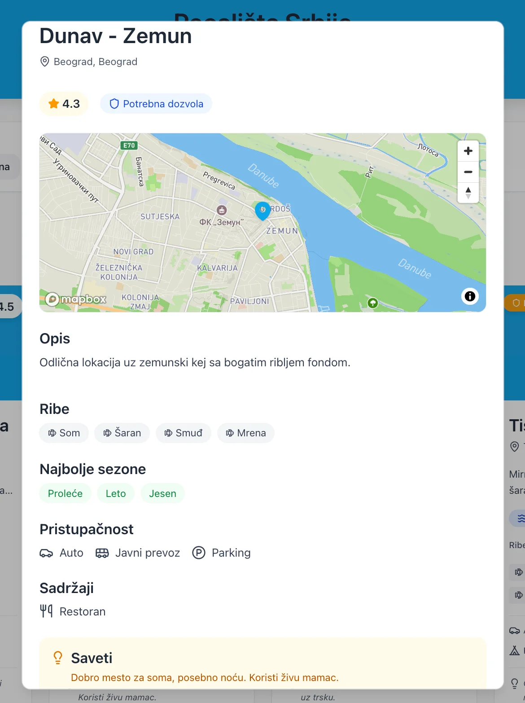
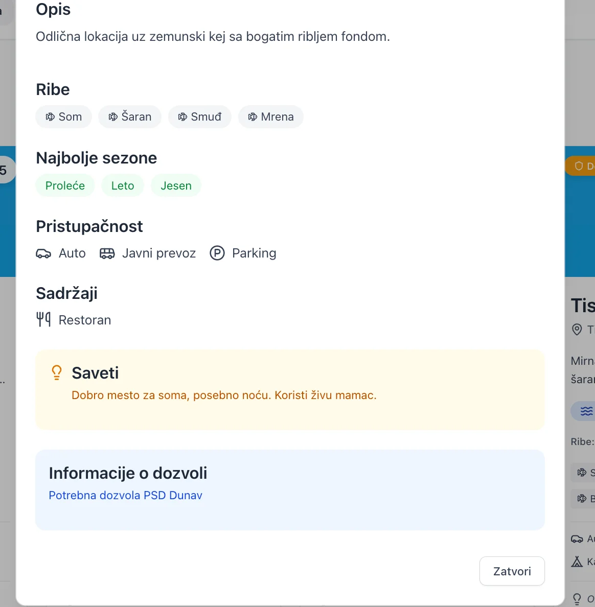

# 🎣 Pecališta Srbije (Fishing Spots Serbia)

> 🎯 This project was built as part of my application for a Frontend Developer internship at FishingBooker.

A modern React application for discovering and exploring fishing spots across Serbia. Browse 25+ locations with detailed information about fish types, seasons, accessibility, and permits.


---

## 📸 Screenshots

### List View
Browse fishing spots as cards with ratings, fish types, difficulty, and quick tips.


### Map View
Interactive Mapbox map showing all 25+ fishing locations across Serbia.



### Filter System
Filter spots by permit requirements, water type (Reka, Jezero, Akumulacija, Bara, Kanal), and season.





### Spot Details Modal
Complete information including embedded map, fish species, best seasons, accessibility, facilities, tips, and permit info.





### Mobile Responsive
Fully responsive design with collapsible filter panel on mobile devices.


---

## ✨ Features

- **🗺️ Interactive Map** - Explore 25+ fishing spots across Serbia using Mapbox GL
- **📋 List & Map Views** - Toggle between card grid and map visualization
- **🔍 Smart Filters** - Filter by water type, season, and permit requirements
- **💾 Persistent Filters** - Filter preferences saved to localStorage
- **📱 Fully Responsive** - Optimized for desktop, tablet, and mobile
- **🎨 Modern UI** - Clean design with Radix UI components and Tailwind CSS

---

## 🛠️ Tech Stack

| Category | Technologies |
|----------|-------------|
| **Framework** | React 19, TypeScript 5.9 |
| **Styling** | Tailwind CSS 4, CSS Variables |
| **UI Components** | Radix UI (Dialog, Select, Tabs, Popover, Checkbox) |
| **Maps** | Mapbox G
| **Icons** | Lucide React |
| **Build Tool** | Vite 7 |

---

## 📁 Project Structure

```
src/
├── components/
│   ├── Filters/          # FiltersBar, WaterTypeSelect, SeasonSelect, PermitToggle
│   ├── Maps/             # AllSpotsMap, SpotMap, SpotPopup
│   ├── SpotCard/         # SpotCard, SpotCardList, SpotDetailsModal
│   ├── ViewToggle/       # Lista/Mapa view toggle
│   └── ui/               # Button, Dialog, Select, Checkbox, Tabs, Toggle
├── data/
│   └── fishingSpots.ts   # 25+ fishing spots with TypeScript types
├── helpers/
│   ├── filterHelpers.ts  # Filter logic
│   └── storageHelpers.ts # localStorage persistence
├── lib/
│   └── utils.ts          # cn() utility for classnames
├── App.tsx
├── main.tsx
└── index.css
```

---

## 🚀 Getting Started

### Prerequisites

- Node.js 18+
- Mapbox account ([get free token](https://mapbox.com))

### Installation

```bash
# Clone the repository
git clone https://github.com/UrosZdravkovic/pecanje-srbija.git
cd pecanje-srbija

# Install dependencies
npm install

# Set up environment variables
echo "VITE_MAPBOX_ACCESS_TOKEN=your_token_here" > .env

# Start development server
npm run dev
```

Open `http://localhost:5173` in your browser.

---

## 📊 Data Model

```typescript
type FishingSpot = {
  id: string;
  name: string;                    // "Dunav - Zemun"
  description: string;
  waterType: WaterType;            // Reka | Jezero | Akumulacija | Bara | Kanal
  coordinates: { lat, lng };
  fishTypes: FishType[];           // ['Šaran', 'Som', 'Smuđ', 'Mrena']
  difficulty: Difficulty;          // Lako | Srednje | Teško
  accessibility: {
    car: boolean;
    publicTransport: boolean;
    parkingAvailable: boolean;
  };
  facilities: {
    restrooms?: boolean;
    camping?: boolean;
    restaurant?: boolean;
  };
  permitRequired: boolean;
  permitInfo?: string;             // "Potrebna dozvola PSD Dunav"
  bestSeasons: Season[];           // ['Proleće', 'Leto', 'Jesen']
  tips?: string;                   // Fishing tips
  region: string;                  // "Beograd", "Vojvodina", etc.
  municipality: string;
  rating?: number;                 // 4.3
};
```

---

## 🔮 Future Improvements

- [ ] User authentication and favorites system
- [ ] Weather integration for each spot
- [ ] "Best time to fish" calculator based on conditions
- [ ] User reviews and ratings
- [ ] PWA support for offline access
- [ ] Direct links to purchase fishing permits

---

## 📝 Available Scripts

| Command | Description |
|---------|-------------|
| `npm run dev` | Start development server |
| `npm run build` | Build for production |
| `npm run preview` | Preview production build |
| `npm run lint` | Run ESLint |

---

## 👤 Author

**Uroš Zdravković**

[](https://github.com/UrosZdravkovic)
[](https://www.linkedin.com/in/uro%C5%A1-zdravkovi%C4%87/)

---
